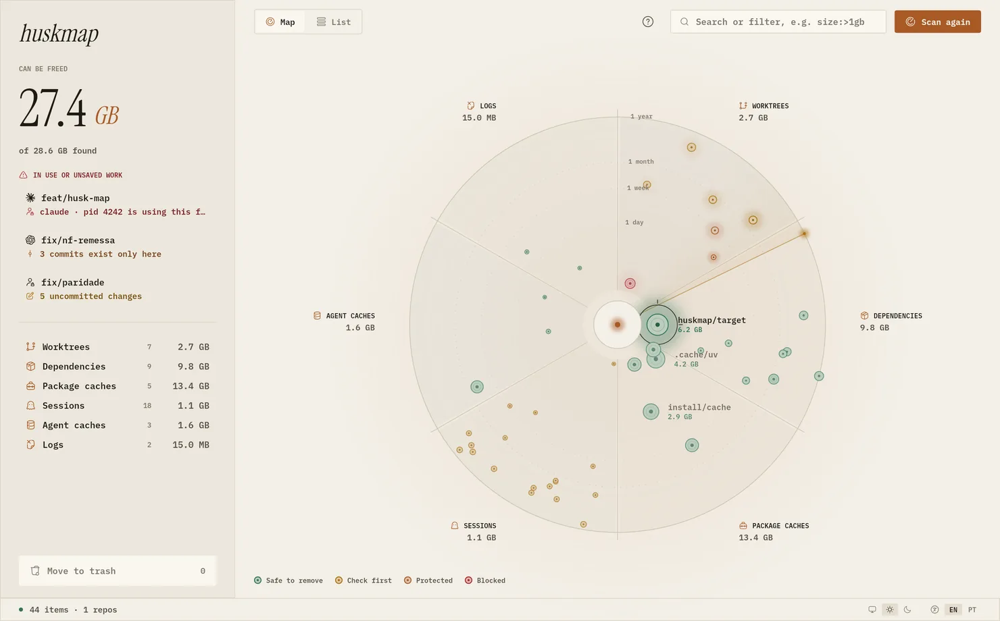

<p align="center">
  
</p>

<h1 align="center">huskmap</h1>

<p align="center">
  <strong>Your AI agents left things behind. Here is what they weigh.</strong><br>
  A calm little map of the worktrees, <code>node_modules</code>, sessions and caches that coding agents leave on your Linux disk.
</p>

<p align="center">
  <a href="https://huskmap.lucascavalheri.com.br">🌐 Website</a>
  ·
  <a href="https://github.com/LucasCavalheri/huskmap/releases/latest">📦 Download</a>
  ·
  <a href="CHANGELOG.md">📝 Changelog</a>
  ·
  <a href="https://huskmap.lucascavalheri.com.br/pt-br/">🇧🇷 Português</a>
</p>

<p align="center">
  <a href="https://github.com/LucasCavalheri/huskmap/releases/latest"></a>
  <a href="https://github.com/LucasCavalheri/huskmap/actions/workflows/ci.yml"></a>
  <a href="LICENSE"></a>
  
  
</p>

<p align="center">
  <picture>
    <source media="(prefers-color-scheme: dark)" srcset="site/public/shots/map-en-dark-1480.webp">
    
  </picture>
</p>

---

## 🤔 Why

Claude Code, Codex, Cursor and friends work in parallel **git worktrees**. Each one grows its own `node_modules` or `target`, every project keeps a session history, and the package caches pile up. After a few weeks that is tens of gigabytes nobody remembers creating.

huskmap finds all of it, shows what is **safe to remove**, and never touches work you have not saved. It is not a generic disk tool: it understands agent folders, session stores and worktree topology, and it knows who is still working where.

## ✨ Highlights

| | |
|---|---|
| 🗺️ **A map, not a list** | Every dot is one item. The slice is its type, the distance from the center its age, the size its weight, the color what you may do. |
| 🛡️ **Your work is safe** | Folders in use, uncommitted changes, commits that exist nowhere else, the main checkout and secret files are protected. |
| 🗑️ **Trash, never delete** | Everything goes to the system trash after one last check, so you can always restore it. |
| 🔎 **Filters you can type** | `kind:deps size:>500mb age:>30d -is:blocked`, in English or Portuguese, on the map and the list. |
| 🌗 **Light and dark** | Daylight and Afterlife, or follow your desktop. Press `t`. |
| 🇧🇷 **English and Portuguese** | Picked from your settings, timezone or locale. Switch any time. |
| ⌨️ **CLI and TUI too** | `huskmap scan --json` for scripts, `huskmap map` on a machine without a screen. |
| 🔒 **Almost offline** | The only network call is a daily update check. No telemetry, no accounts. |

## 🚀 Install

```bash
curl -fsSL https://huskmap.lucascavalheri.com.br/install.sh | bash
```

The script picks the package for your processor and distro, checks it against the release's `SHA256SUMS` and installs it. `--user` installs into `~/.local` without root, `--print-plan` shows what it would fetch. If huskmap is open, it waits for anything moving to the trash and reopens the map with your marks.

Or grab a package from the [website](https://huskmap.lucascavalheri.com.br/#download) or the [latest release](https://github.com/LucasCavalheri/huskmap/releases/latest):

| 📦 File | 🐧 Distros |
| ------- | ---------- |
| `huskmap_<ver>_amd64.deb` · `_arm64.deb` | Debian, Ubuntu, Mint, Pop!_OS, Kali |
| `huskmap-<ver>-1.x86_64.rpm` · `.aarch64.rpm` | Fedora, RHEL, Rocky, Alma, openSUSE |
| `huskmap-<ver>-1-x86_64.pkg.tar.zst` · `-aarch64` | Arch, Manjaro, EndeavourOS |
| `huskmap-<ver>-r0-x86_64.apk` · `-aarch64` | Alpine (with `gcompat`) |
| `huskmap-linux-x64.tar.gz` · `-arm64` | Gentoo, Void, NixOS, anything else |

Every package brings the desktop entry, icons, man page and bash, zsh and fish completions. glibc and musl, x86_64 and ARM64, X11 and Wayland.

## 🧭 How it works

1. 🔍 **Scan.** huskmap reads agent folders, your project folders and package caches. It only reads.
2. 👀 **Look.** Open the map or the list. Click anything to see its size, age, branch and what protects it.
3. ✅ **Mark.** Tick what can go, or filter and press **Mark N removable**.
4. 🗑️ **Move to trash.** Read the summary and confirm. Everything is checked again first.

The first launch opens a built-in guide (`?` any time) that explains the map, the six types, the protections, every filter and every key.

## 🧺 What it finds

| | Type | What | Examples |
|---|---|---|---|
| 🌿 | **Worktrees** | extra copies of a repo agents create | `~/.codex/worktrees/*`, `.claude/worktrees/*`, `*-worktrees/*` |
| 📦 | **Dependencies** | build and install folders, only next to their project file | `node_modules`, `target`, `.venv`, `.next`, `.turbo`, `.nuxt`, `.svelte-kit` |
| 🧰 | **Package caches** | download caches, fetched again when needed | npm, pnpm, yarn, bun, pip, uv, poetry, cargo, go, Playwright |
| 👻 | **Sessions** | agent conversation history, matched to its project | `~/.claude/projects/*`, `~/.codex/sessions/*`, `~/.grok/sessions/*` |
| 🗄️ | **Agent caches** | files agents keep for themselves | `~/.cache/codex-runtimes`, `~/.claude/file-history` |
| 📜 | **Logs** | agent logs and prompt history | `*.log`, `history.jsonl` |

Agents it knows: **Claude Code, Codex, Cursor, Grok, Gemini CLI, OpenCode and Aider.**

## 🛡️ What protects an item

Before anything is marked, and again right before anything moves, huskmap asks:

- 🔴 **Is someone in there?** Any process (agent, shell, editor, dev server) working inside the folder, read from `/proc`. Never removed, not even by force.
- 🔴 **Is it the main checkout, or outside the scanned folders?** Never removed.
- 🔴 **Does it hold secret files that exist only there?** A `.env` that is a copy of the main checkout's does not count; a unique one keeps the folder.
- 🟠 **Uncommitted changes, or commits that exist on no other branch or remote?** Protected. You can still **mark anyway** (`X`), and the branch always stays in the repo.
- 🟡 **A session whose project is gone?** Flagged, usually safe to remove.

## 🔎 Filters

Click the chips above the list, or type in the search box. Everything you type must match, and it works on the map too.

```text
kind:deps size:>500mb age:>30d          # big, old dependency folders
is:uncommitted,unpushed                  # worktrees holding work
agent:claude -is:blocked "fix/"          # Claude's leftovers you may remove
tipo:sessoes status:orfao                # the same keys in Portuguese
```

Keys: `kind`/`tipo`, `is`/`status`, `agent`/`agente`, `size`/`peso`, `age`/`idade`, `branch`, `path`/`caminho`, `eco`. A leading `-` excludes, commas mean "any of".

## ⌨️ Keyboard

| Key | Does |
| --- | ---- |
| `j` / `k` | next / previous item |
| `enter` | open details |
| `x` / `X` | mark / mark anyway |
| `a` | move marked items to the trash |
| `/` | search and filter |
| `1` to `6` | show one type |
| `tab` | map or list |
| `s` | scan again |
| `t` | theme: system, light or dark |
| `u` | install an update |
| `?` | the guide |

## 🖥️ Command line

```bash
huskmap                         # the desktop map on X11/Wayland, a text scan otherwise
huskmap scan [PATH]... [--json] [--min-size 500M] [--category worktree] [--all]
huskmap doctor                  # can huskmap scan this machine?
huskmap plan [--preset safe|agent-only|older] [--only PATH]... [--force] [-o plan.json]
huskmap apply --plan plan.json [--force]
huskmap map                     # browse the last scan in the terminal
huskmap update [--check]
huskmap completions bash|zsh|fish
```

Default is scan and plan: nothing moves until you apply. Apply re-reads size, mtime, git state and processes first, and anything that drifted is skipped. Only one removal runs at a time.

## 🔄 Updates

Once a day the app asks GitHub Releases for a newer huskmap. When there is one, a chip shows up in the status bar (`u`): it downloads the update, checks the SHA256, installs it the way this copy was installed (a package through `pkexec`, or an in-place swap for the portable build) and reopens with your marks.

```bash
huskmap update --check          # is there one?
huskmap update                  # install it (asks first, -y to not)
HUSKMAP_NO_UPDATE_CHECK=1       # never check
```

## 🌍 Language

English and Brazilian Portuguese, in this order:

1. `--lang en|pt-br` or `HUSKMAP_LANG`
2. your pick in the app, saved in `$XDG_CONFIG_HOME/huskmap/settings.json`
3. your machine: a Brazilian timezone or a `*_BR` locale reads Portuguese, anything else English

No network lookup: the machine's own settings decide.

## 🛠️ Build from source

```bash
cargo run -p huskmap-cli            # opens the map when a display exists
cargo test --workspace --all-features
cargo clippy --workspace --all-targets --all-features -- -D warnings
cargo cov                           # coverage on huskmap-core (cargo-llvm-cov)
bash scripts/install.test.sh        # installer flow, in a throwaway HOME
```

Freya and Skia link against `libfreetype`, `fontconfig`, `EGL`, `GL` and `GLESv2` (`libgles-dev` on Debian and Ubuntu). If your distro has no unversioned `.so` stubs, put them in `./link-libs` (ignored by git); `.cargo/config.toml` points the linker there.

```
huskmap-core   scan, classify, size, risk, plan, apply   (no UI dependencies)
huskmap-cli    clap commands, ratatui map, JSON
huskmap-gui    Freya desktop app, talks only to core
site/          the website (Astro, static)
```

## 📦 Releasing

1. Bump `version` in `Cargo.toml` and add a `## <version>` section to `CHANGELOG.md`.
2. Tag `v<version>` and push. The release workflow checks they agree, builds x86_64 and ARM64, packages every family, writes `SHA256SUMS`, attests provenance, publishes with the changelog as notes and rebuilds the website.

## 🤝 Contributing

Issues and pull requests are welcome. Read [`AGENTS.md`](AGENTS.md) first: it holds the rules this project lives by (Linux only, safety first, plain words, tests in the same change).

## 📄 License

[MIT](LICENSE). Agent and tool logos belong to their owners and only identify what huskmap finds.
